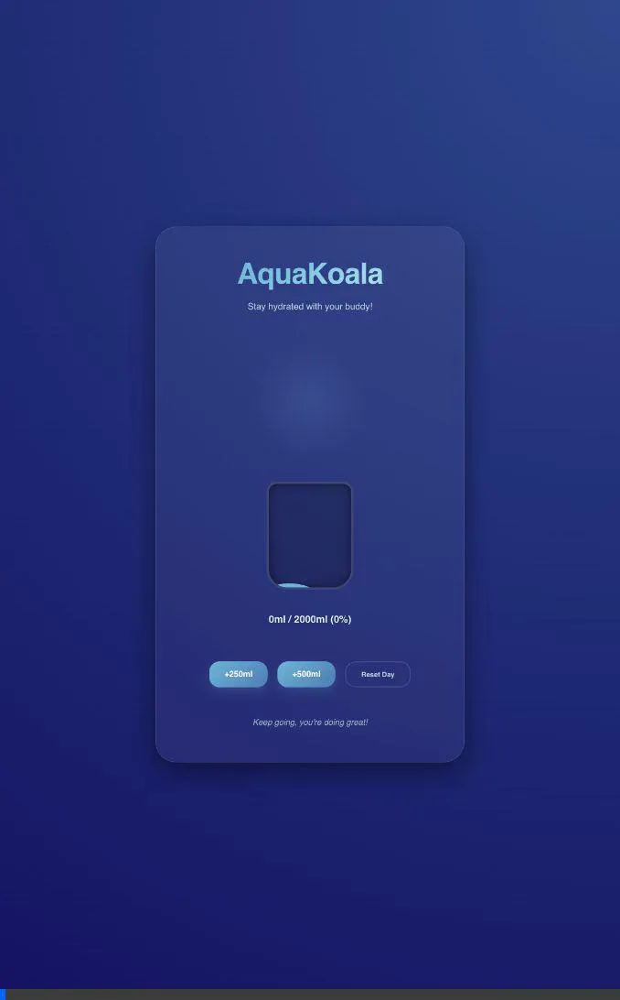
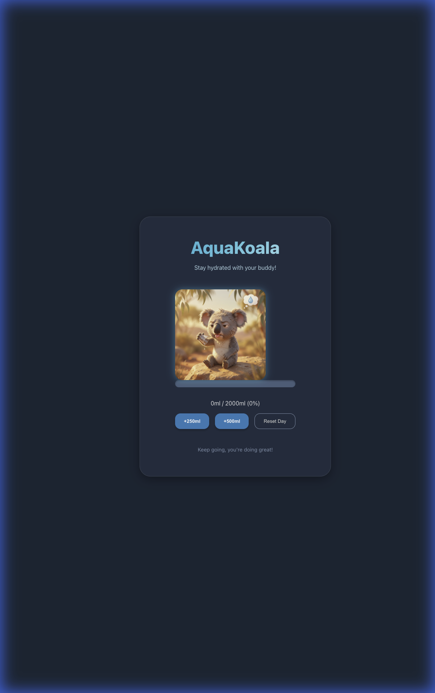
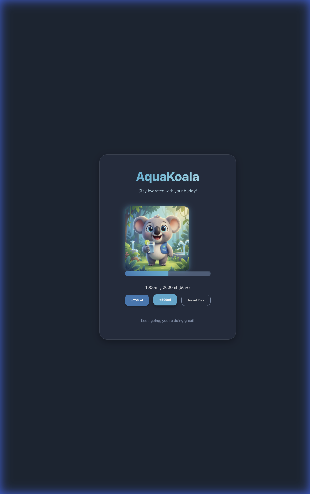
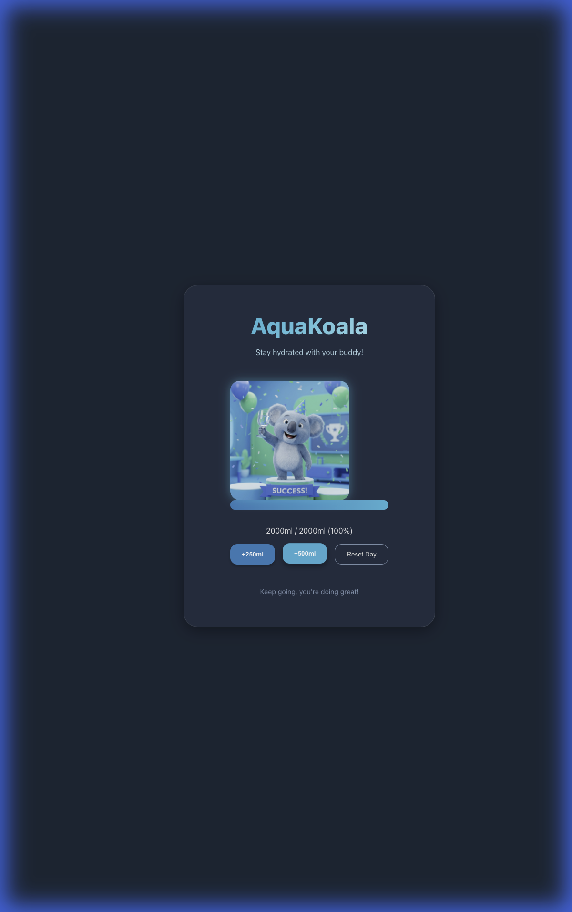
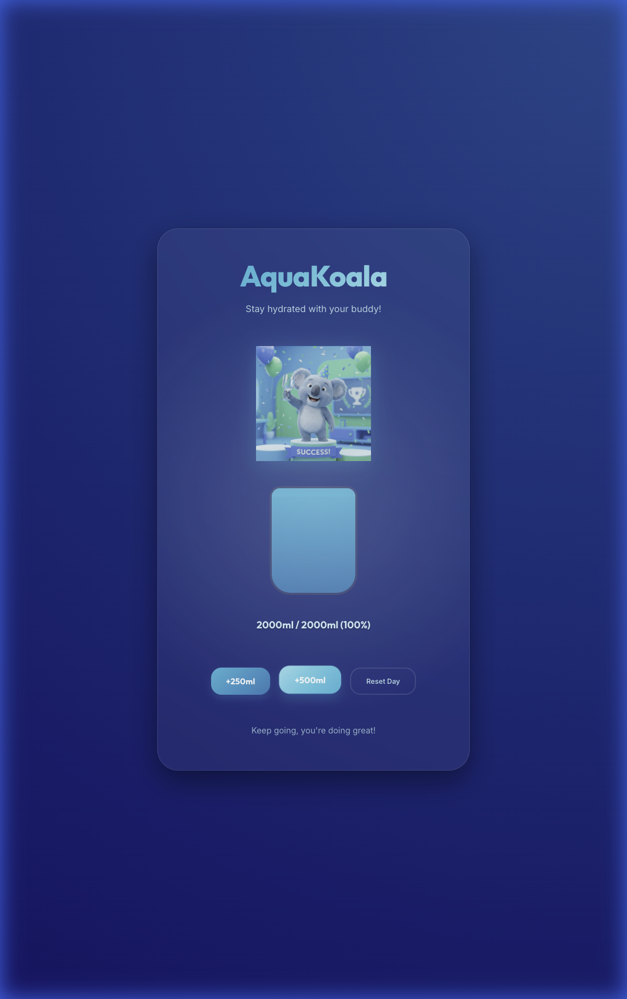

# AquaKoala - Your Hydration Buddy 🐨💧

> [!NOTE]
> This is an experiment first using Google Antigravity to build an iOS app.

AquaKoala is a playful and premium hydration tracking application designed to help you stay hydrated throughout the day. With a sleek glassmorphic UI and a friendly Koala mascot, tracking your water intake has never been more delightful.

## Features

- **Liquid Tank Visualization**: A dynamic, animated water tank that fills up as you log your intake.
- **Interactive Koala Buddy**: Your Koala companion reacts to your hydration levels—thirsty, happy, or ready to party!
- **Premium Design**: Built with modern CSS techniques like glassmorphism, smooth gradients, and custom animations.
- **Celebration Mode**: Reach your daily goal (2000ml) to trigger a celebration with your Koala buddy.

## Preview

### App in Action


### Mascot States
I've designed the Koala buddy to reflect your hydration progress:

| Thirsty (0ml) | Happy (1000ml) | Celebration (2000ml) |
| :---: | :---: | :---: |
|  |  |  |

### Goal Reached


## Tech Stack

- **Frontend**: React (Vite)
- **Styling**: Vanilla CSS (Modern Design Tokens, Glassmorphism)
- **Typography**: Outfit (Headings), Inter (Body)

## Getting Started

### Prerequisites

- [Node.js](https://nodejs.org/) (Latest LTS recommended)
- [npm](https://www.npmjs.com/) (Standard with Node.js)

### Installation

1. Clone the repository (or extract the project files).
2. Navigate to the project directory:
   ```bash
   cd drinkWater
   ```
3. Install dependencies:
   ```bash
   npm install
   ```

### Running the App

To start the development server:
```bash
npm run dev
```

The application will be available at `http://localhost:5173/`.

### Building for Production

To create an optimized production build:
```bash
npm run build
```

The output will be generated in the `dist/` directory.

## Project Structure

- `src/assets/`: Contains Koala character images.
- `src/App.jsx`: Main application logic and component structure.
- `src/App.css`: Custom premium styles, including the liquid tank and glassmorphism.
- `src/index.css`: Global design system and theme variables.

Stay hydrated! 🐨🌊
